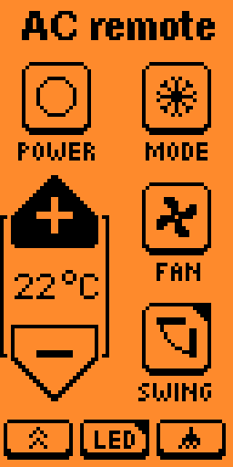
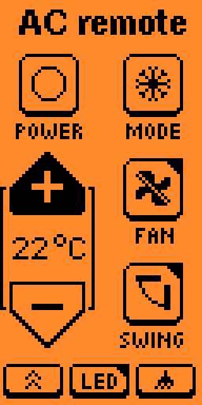

# Midea AC Remote

Midea Electric AC remote control for Flipper Zero.

Compatible with `RG10B(B)/BGEF` remote type and probably others similar: `RG10B(B1)/BGEFU1`, `RG10B1(B)/BGEF`, `RG10B2(B)/BGCEF`,
`RG10B10(B)/BGEF`.

Based on [Mitsubishi AC Remote](https://github.com/achistyakov/flipperzero-mitsubishi-ac-remote) code by [@achistyakov](https://github.com/achistyakov).

Protocol description [here](./lib/hvac_midea/README.md).





Black top-right corner of the button indicates long-press availability. Actions:
* "Swing" button: sends command to toggle vertical swing instead of horizontal one (if supported)
* "LED" button: sends command to change between desired and ambient temperature indication (if supported)
* "Fan" button: toggle silent mode if supported, reset on power off, if mode or fan power changed or if "Turbo"/"Clean" pressed.

## Building
```shell
# Clone repository
git clone https://github.com/xakep666/flipperzero-midea-ac-remote.git
cd flipperzero-midea-ac-remote

# Build the application
ufbt build

# Build and launch the application
ufbt launch
```

## TODO
- [ ] Publish to Flipper App Catalog
- [x] Support Silent mode
- [ ] Support Night mode
- [ ] Support timers setting
- [ ] Support external IR emitter (?)
