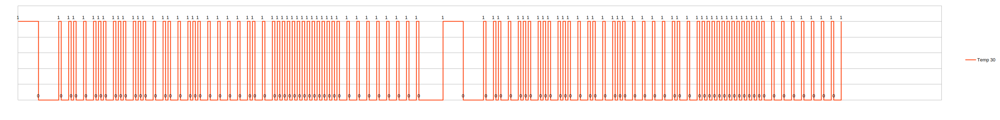
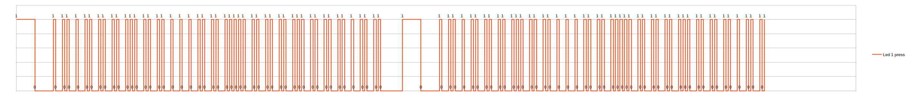
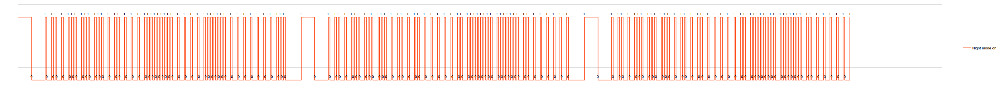

# Midea AC Remote protocol implementation

This library based on analysis of raw samples from `RG10B(B)/BGEF` remote.

Analysis was performed with great help of [LibreOffice Calc](https://www.libreoffice.org/discover/calc/).

## Data encoding and transmission

Parameters:
* Carrier frequency - 33kHz
* Duty cycle - 0.33

This vendor has custom protocol.

Terms:
* Mark - period when IR-led is "on" (pulses on carrier frequency)
* Space - period when IR-led is off
* Packet - sequence of bits encoded with space encoding (aka pulse distance modulation), started by specific start sequence. Each packet size is exactly 6 bytes.
* Message - sequence of packets sent with required pause between them. Usually one message contains two repeated packets, but not always.

Packet start sequence: 4.4ms mark, 4.4ms space.

Bits encoding scheme: each bit starts with 0.56ms mark, than following space determines which bit is encoded. 1.6ms for logic zero, 0.56ms for logic one.

Each packet must be finished with 0.56ms mark and 5ms space before next packet start.

Example plots:

Turning "Night mode" is the only command that generates a message with 3 packets.

## Packet structure

Almost always (except timers setup) every odd byte in packet is an inverted previous even byte. I.e. byte 1 is inverted byte 0, byte 3 is inverted byte 2, etc. So I'll omit even bytes for brevity in most cases.

Let's overview most common case: basic settings packet __without__ timers
<table>
<thead>
    <tr>
        <th>Byte/Bit</th>
        <th>0</th>
        <th>1</th>
        <th>2</th>
        <th>3</th>
        <th>4</th>
        <th>5</th>
        <th>6</th>
        <th>7</th>
    </tr>
</thead>
<tbody>
    <tr>
        <td>0</td>
        <td colspan=5>Header Magic</td>
        <td colspan=3>Type</td>
    </tr>
    <tr>
        <td>2</td>
        <td colspan=3>Fan power</td>
        <td>Select Swing/Power Off</td>
        <td>1</td>
        <td>Toggle swing or shutdown if 0</td>
        <td>1</td>
        <td>1</td>
    </tr>
    <tr>
        <td>4</td>
        <td colspan=4>Temperature</td>
        <td colspan=2>Mode</td>
        <td>0</td>
        <td>0</td>
    </tr>
</tbody>
</table>

_Header Magic_ is always `0xD`

_Type_ may be:
* Settings `0x4` - parameters tracked by remote (except Swing toggle)
* Command `0xA` - not tracked by remote, just toggle something on AC unit, has slightly different packet stucture

_Fan power_ has following values:
|Value|Binary|Hex|
|---|---|---|
|Lockout|000|0x0|
|1|001|0x1|
|2|010|0x2|
|3|100|0x4|
|Auto|101|0x5|
|Ignore|110|0x6|

_Lockout_ value used in `Auto` and `Dry` modes.

_Ignore_ value used to power off unit or toggle swing

_Mode_ has following values:
|Value|Binary|Hex|
|---|---|---|
|Cold|00|0x0|
|Dry/Fan|10|0x2|
|Heat|11|0x3|
|Auto|01|0x1|

_Dry_ and _Fan_ modes are differentiated by _Fan power_: for _Dry_ it will be _Lockout_ (`0x0`) value. _Auto_ mode also must have _Lockout_ fan power.

_Temperature_ is encoded as an addition to minimal temperature (17 degrees Celsius) using cusom Gray code.
|Value|Binary|Hex|
|---|---|---|
|17|0000|0x0|
|18|1000|0x8|
|19|1100|0xC|
|20|0100|0x4|
|21|0110|0x6|
|22|1110|0xE|
|23|1010|0xA|
|24|0010|0x2|
|25|0011|0x3|
|26|1011|0xB|
|27|1001|0x9|
|28|0001|0x1|
|29|0101|0x5|
|30|1101|0xD|
|Ignore|0111|0x7|

_Ignore_ value used to power off or toggle swing.

Here is the combination of values for specific actions
|Action|Fan power|Temp|Bit #3, byte #2|Bit #5, byte #2|
|---|---|---|---|---|
|Shutdown (power off)|110|0111|1|0|
|Swing toggle|110|0111|0|0|

Let's overview a __command__ packet:
<table>
<thead>
    <tr>
        <th>Byte/Bit</th>
        <th>0</th>
        <th>1</th>
        <th>2</th>
        <th>3</th>
        <th>4</th>
        <th>5</th>
        <th>6</th>
        <th>7</th>
    </tr>
</thead>
<tbody>
    <tr>
        <td>0</td>
        <td colspan=5>Header Magic</td>
        <td colspan=3>Type</td>
    </tr>
    <tr>
        <td>2</td>
        <td colspan=8>Command magic 1</td>
    </tr>
    <tr>
        <td>4</td>
        <td colspan=4>Command magic 2</td>
        <td colspan=5>Command</td>
    </tr>
</tbody>
</table>

For _Command_ packet _Type_ will be `0xA`. _Command magic 1_ is always `0xAF`. _Command magic 2_ is always `0x5`.

_Command_ has following values:
|Value|Binary|Hex|
|---|---|---|
|Silent|01101|0xD|
|Swing long|00110|0x6|
|Turbo|01000|0x8|
|LED|10100|0x14|
|LED long|00100|0x4|
|Clean|01010|0xA|

_Swing long_ sent after long press on _Swing_ button and activates vertical swing if AC unit supports it.

_LED long_ sent after long press on _LED_ button toggles led indicator between desired and ambient temperature if AC unit supports it.

## TODO

- [ ] Cover _Night mode_
- [ ] Cover _Timers_ 